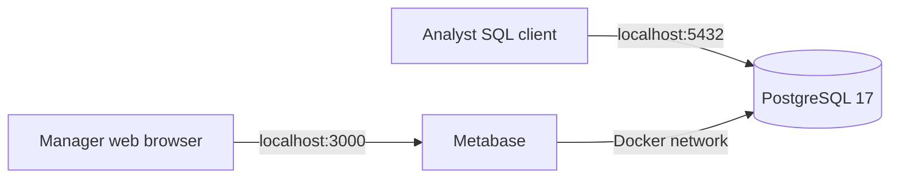

# ABC Foodmart Metabase Dashboard — Local Deployment

This repository section contains a local-only Docker deployment for the ABC Foodmart PostgreSQL database and Metabase dashboard. It is designed for coursework review and local demonstration; no cloud server or public URL is required.

## Architecture



## Included

- Docker Compose configuration for PostgreSQL 17 and Metabase.
- A PostgreSQL custom-format dump containing the 19-table ABC Foodmart schema and sample data.
- Cross-platform startup and shutdown scripts.
- Representative Metabase SQL for the five dashboard modules.
- Dashboard screenshots and setup documentation.
- Security-safe defaults: local interfaces only, no committed passwords, and no Metabase user database.

## Requirements

- Docker Desktop on Windows or Docker Engine with Compose on macOS/Linux.
- At least 2 GB of available memory.
- Ports `3000` and `5432` available on the local computer.

## Quick start — Windows

```powershell
Copy-Item .env.example .env
notepad .env
powershell -ExecutionPolicy Bypass -File .\scripts\start.ps1
```

Replace `POSTGRES_PASSWORD` in `.env` before starting.

## Quick start — macOS/Linux

```bash
cp .env.example .env
nano .env
chmod +x scripts/*.sh
./scripts/start.sh
```

When startup completes, open [http://localhost:3000](http://localhost:3000). Follow [docs/METABASE_SETUP.md](docs/METABASE_SETUP.md) for the first-time Metabase connection.

## Stop the local services

Windows:

```powershell
.\scripts\stop.ps1
```

macOS/Linux:

```bash
./scripts/stop.sh
```

The commands preserve PostgreSQL and Metabase runtime data. To restore the supplied business database again, run:

```powershell
.\scripts\start.ps1 -ResetDatabase
```

`-ResetDatabase` replaces the local ABC Foodmart database objects and should only be used when a clean restore is intended.

## Dashboard modules

### 1. Store Overview


Executive KPIs, monthly sales versus operating expenses, and sales by day of week.

### 2. Sales & Products


Units sold, basket size, returns, category sales share, product ranking, and hourly demand.

### 3. Workforce & Attendance


Labor utilization, attendance, absences, late arrivals, employee detail, and time-off requests. The final dashboard does not include the removed **Actual Labor Hours by Job Role** card.

### 4. Inventory & Receiving


Inventory adjustments, loss, reorder proximity, open deliveries, and slow-moving stock.

### 5. Operating Expenses


Expense KPIs, monthly trend, expense mix, and transaction-level detail.

## Repository structure

```text
github-dashboard-local/
├── database/
│   └── abc_foodmart_final.dump
├── docs/
│   └── METABASE_SETUP.md
├── queries/
│   ├── 01_monthly_sales_vs_operating_expenses.sql
│   ├── 02_sales_share_by_category.sql
│   ├── 03_workforce_attendance.sql
│   ├── 04_inventory_adjustments_by_reason.sql
│   ├── 05_slowest_selling_products.sql
│   └── 06_operating_expenses_by_type.sql
├── screenshots/
├── scripts/
│   ├── start.ps1
│   ├── start.sh
│   ├── stop.ps1
│   └── stop.sh
├── .env.example
├── .gitignore
├── docker-compose.yml
└── README.md
```

## Security and reproducibility

- `.env` is ignored and must never be committed.
- Metabase runtime data is ignored because it can contain user accounts and database credentials.
- PostgreSQL and Metabase listen only on `127.0.0.1`.
- The database dump contains the project schema and synthetic course data, not production customer data.
- Image and SQL files document the final dashboard without relying on a public server.
